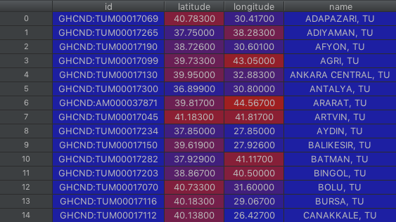

# noaa-weather

You can access historical weather data with NOAA Weather API.

## Getting Started

Method : ```get_all_stations_in_location(): ```

Returns all stations in that given country.
```df_s``` is a data frame that contains information such as station code, latitude and longitude.

```
from noaa import get_all_stations_in_location as gas

df_s = get_all_stations(dataset, location, n_token)
```

```df_s``` looks like this:




Method : ```get_bulk_weather_in_station():```


Returns one historical weather report for a given station between two dates, using one of the resulting station id's.

Date: Must be in ```String``` and ```YYYY-MM-DD``` format. Example: ```'2019-06-26'```
```
df_w = get_bulk_weather_in_station(dataset, location, s_date, e_date, n_token)
```


```df_w``` looks like this:


For more information about abbreviations: ftp://ftp.ncdc.noaa.gov/pub/data/ghcn/daily/readme.txt


